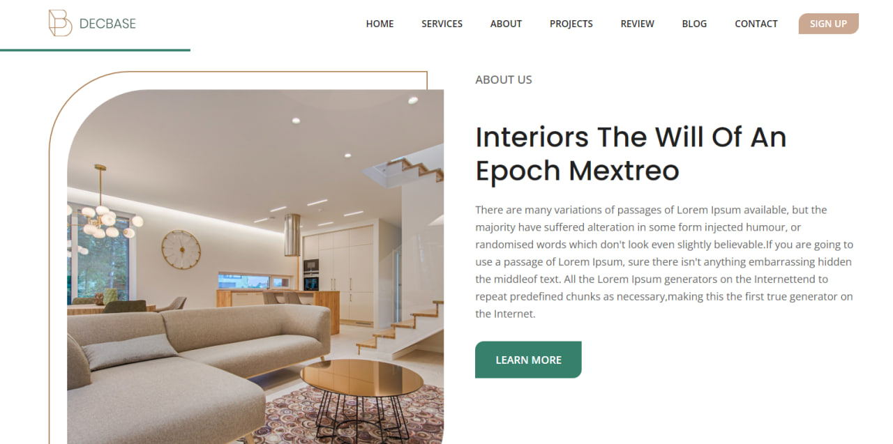

# JS_CAMP Homework 4 - Decbase

# Technologies used

- HTML
- CSS with SASS preprocessor
- JavaScript

# How to use

To access the landing page you need to download the project and open the index.html file locally on your computer

# API

'Services' section  using API [url](https://dummyjson.com/products:)\
Also added 'Map' section using API [url](https://snazzymaps.com/)

  

